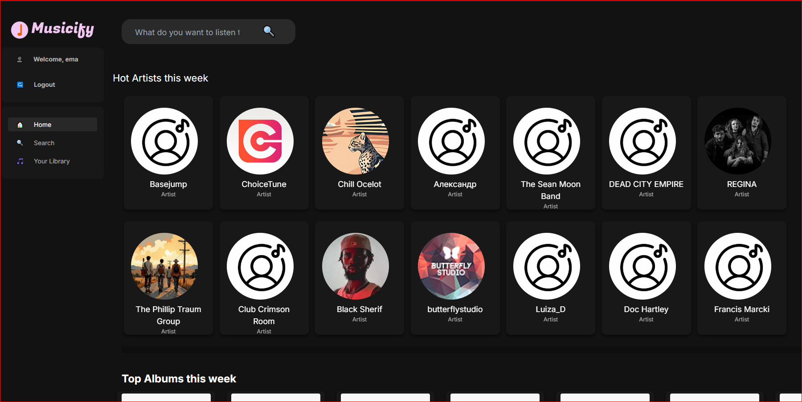
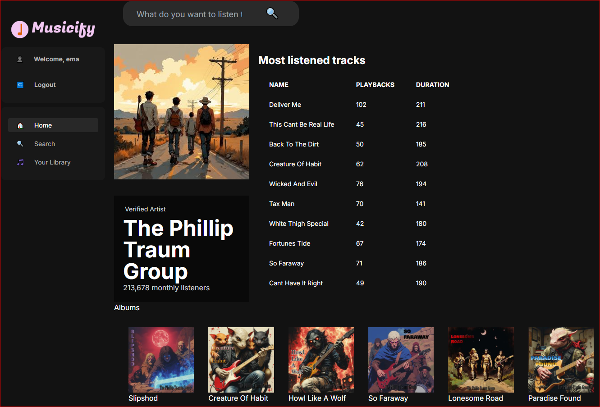
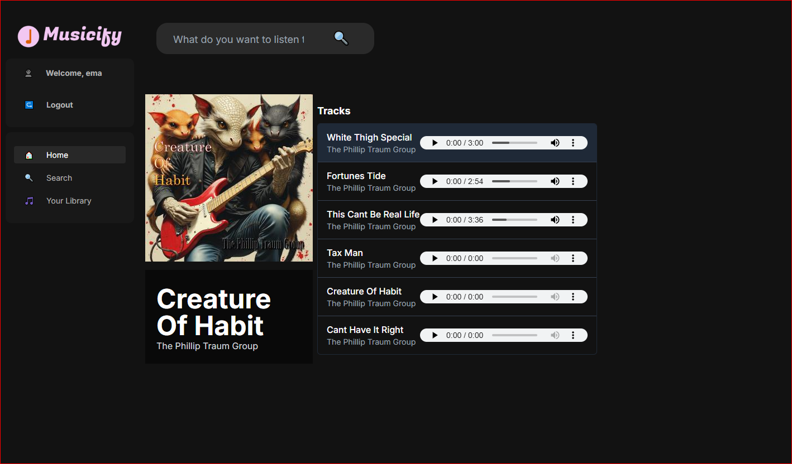
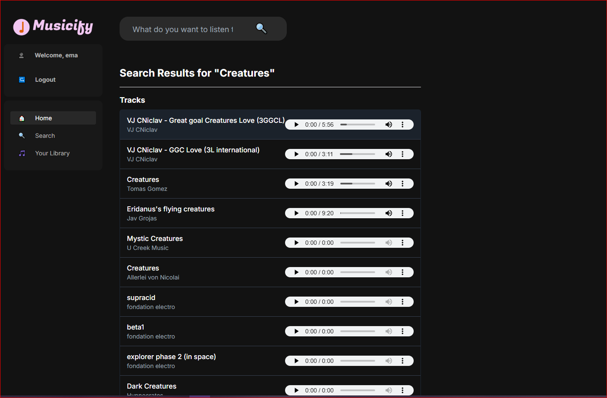

# MUSICIFY

## Description

- This is a "spotify clone" app that uses Jamendo's free API to stream music.
- It fetches some weekly trend data (such as top artists and albums) in your home screen, plus allows you to search in the search bar.
- You can see each artist's most listened songs and also all their albums. Opening an album shows you the tracklist.
- Because this was done all using backend, the music player is static and you cannot navigate away and keep listening. But when searching or browsing albums you can easily change songs.

## Technical design

- Built entirely in django. Took some HTML and CSS from some tutorials but ended up reworking a lot of it and building django templates.

## Structure:

- Project is divided in 2 apps: Auth and "Spotify".
- Templates:
  - Used a base django template to display the logo, sidebar and searchbar, and then extended this base.html for most pages (search page, artist page, album page, and home page)
  - Used some partial templates to build the rest (the sidebar, searchbar, and the top albums and top artists section are included by other templates)
- Services
  - Created a services.py to handle API Calls, which i use to call Jamendo API for tracks, artists, and albums with different parameters.
- Utils
  - Used basic MemCache to avoid redundant API calls, storing most recently used data (removing LRU).
  - This means if you just opened an album, browse away, and then come back to that album, you dont do redundant API calls to fetch it again, unless the cache exceeds its max allowed.

## Screenshots

### Homepage

### Artist

### Album with its tracklist

### Search Results

